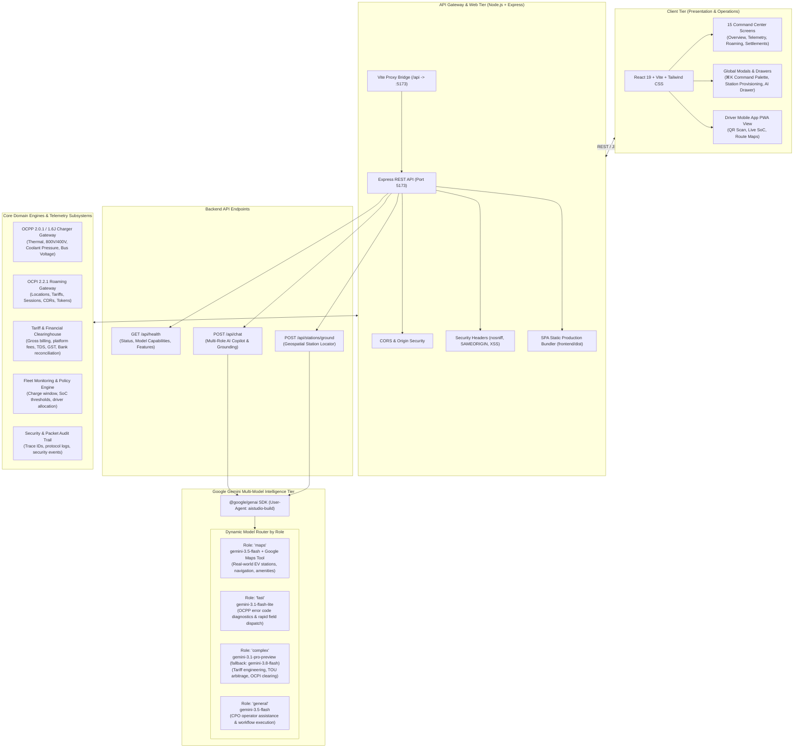
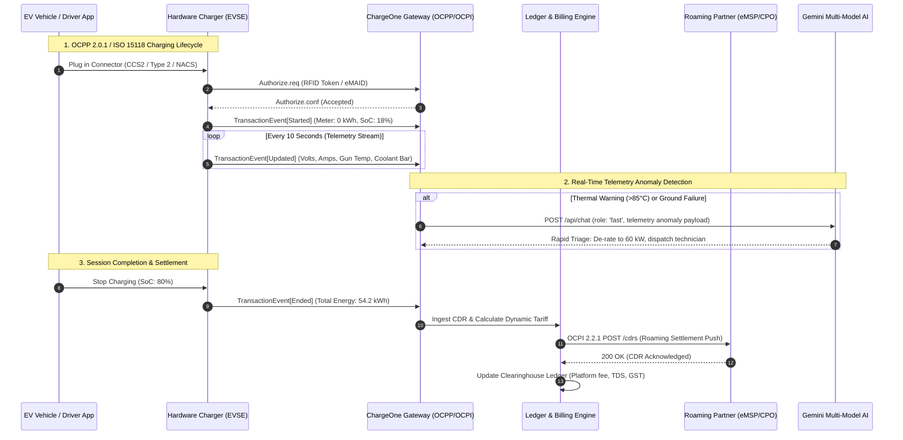

# ChargeOne Energy Network OS — System Architecture

Enterprise CPO Operations Command Center, OCPI/OCPP Roaming Gateway, Charger Telemetry Mesh, and Financial Clearinghouse Ledger.

---

## 1. High-Level Architecture



---

## 2. Architectural Layers & Responsibilities

### Layer 1: Client & Presentation Tier (`frontend/`)
Built with **React 19**, **Vite**, and **Tailwind CSS**, providing a high-performance operator cockpit:
- **Operations Dashboard (`OverviewDashboard.tsx`)**: Real-time network throughput, active power (MW), active charging sessions, revenue run-rate, and regional grid load metrics.
- **Hardware Telemetry Mesh (`LiveTelemetryHealth.tsx`)**: Sub-second component health monitoring (power module temperatures, gun A/B thermals, phase voltages L1/L2/L3, coolant pump RPM, isolation resistance in MΩ).
- **Session Audit Dossier (`SessionAuditDossier.tsx`)**: Granular Charge Detail Record (CDR) auditing, SoC curves, kWh delivery verification, and dispute resolution.
- **Inter-CPO Roaming Center (`IntegrationCenter.tsx`)**: OCPI 2.2.1 sync status with partner networks (Tata Power EZ, Shell Recharge, Zeon, Tesla Supercharger network).
- **Financial Clearinghouse (`FinancialSettlements.tsx`)**: Multi-party settlement reconciliation, TDS, platform commission splits, GST compliance, and net payouts.
- **Driver Mobile Experience (`DriverMobileApp.tsx`)**: Emulated mobile PWA for EV drivers (station search, connector reservation, QR scan to charge, live SoC battery animation).
- **Global Command Interfaces**:
  - `⌘K / Ctrl+K`: `CommandPaletteModal.tsx` for instant screen switching and session lookup.
  - `⌘J / Ctrl+J`: `AiMapsAssistantDrawer.tsx` for interactive AI navigation and diagnostics.

---

### Layer 2: API Gateway & Static Server (`backend/`)
Implemented in **Express + TypeScript** (`backend/server.ts`):
- **Single-Port Production Deployment**: Automatically detects `frontend/dist`. When present, Express serves the production React bundle and routes all unknown paths to `index.html` (SPA fallback).
- **CORS & Origin Security**: Controlled via `CLIENT_ORIGIN` (defaults to `http://localhost:3000` during separate dev server operation).
- **Security Headers**: Injects `X-Content-Type-Options: nosniff`, `X-Frame-Options: SAMEORIGIN`, `X-XSS-Protection`, and `Referrer-Policy: strict-origin-when-cross-origin`.
- **Unified Environment Architecture**: Centrally managed via root `.env` (with `.env.local` override support), shared seamlessly between frontend Vite bundler, backend Express server, and Prisma ORM.

---

### Layer 3: AI Intelligence & Google Maps Grounding Tier
Powered by the official `@google/genai` SDK with **dynamic role-based model routing**:

| Role / Intent | Target Model | Specialized Function | Tools Attached |
| :--- | :--- | :--- | :--- |
| **`maps`** *(Geospatial Navigation)* | `gemini-3.5-flash` | Locates real EV charging plazas, connector types (CCS2, Type 2, NACS), real addresses, and adjacent amenities (cafes, restrooms, hotels). | `googleMaps: {}` with user lat/lng retrieval bias. |
| **`fast`** *(Rapid Error Triage)* | `gemini-3.1-flash-lite` | Instant diagnosis (<150 words) for field technicians on OCPP error codes (`GroundFailure`, `PowerMeterFailure`, `HighTemperature`). | None (low latency optimized). |
| **`complex`** *(Tariff & Clearing Audit)* | `gemini-3.1-pro-preview`<br>*(fallback to `gemini-3.8-flash`)* | High-order mathematical reasoning for Time-of-Use (TOU) arbitrage, demand penalty mitigation, and clearinghouse settlement disputes. | None (deep reasoning mode). |
| **`general`** *(CPO Co-Pilot)* | `gemini-3.5-flash` | General fleet operational guidance, session overrides, and station troubleshooting. | Conversational context. |

---

## 3. Protocol Integration Architecture



---

## 4. Directory & File Mapping

```
chargeone-energy-network-os/
│
├── .env                              # Root monorepo configuration (port, api keys, proxy)
├── .env.example                      # Root environment template
├── package.json                      # Monorepo orchestrator (npm workspaces: frontend, backend)
├── tsconfig.json                     # TypeScript Solution configuration
├── ARCHITECTURE.md                   # System Architecture Documentation
│
├── backend/                          # Express + TypeScript API Server
│   ├── .env                          # Backend runtime environment configuration
│   ├── .env.example                  # Backend environment template
│   ├── package.json                  # Backend dependencies (@google/genai, express, cors, dotenv)
│   ├── tsconfig.json                 # Backend TypeScript compiler settings (NodeNext)
│   └── server.ts                     # Core API server:
│                                     #   - /api/health
│                                     #   - /api/chat (Multi-role Gemini routing + Maps)
│                                     #   - /api/stations/ground (Google Maps Grounding)
│                                     #   - Static SPA delivery (frontend/dist fallback)
│
└── frontend/                         # React 19 Client Application
    ├── .env                          # Frontend environment configuration (VITE_API_URL)
    ├── vite.config.ts                # Vite bundler config with /api reverse proxy to :5173
    ├── package.json                  # Frontend dependencies (lucide-react, react, tailwindcss)
    ├── tsconfig.json                 # Frontend TypeScript compiler settings (ESNext)
    ├── index.html                    # Single Page App shell
    └── src/
        ├── main.tsx                  # React entry point
        ├── App.tsx                   # Central state machine (screen router, modals, hotkeys)
        ├── index.css                 # Design system tokens and custom utilities
        ├── types/
        │   └── index.ts              # Data contracts: ChargerNode, ActiveSession,
        │                             # RoamingPartner, SettlementBatch, ChatbotRole
        ├── data/
        │   └── mockData.ts           # Seed dataset: 400V/800V chargers, sessions, settlements
        └── components/
            ├── Header.tsx            # Network status, live alerts, quick action triggers
            ├── Sidebar.tsx           # Category navigation (Ops, Roaming, Finance, Field)
            ├── modals/
            │   ├── AiMapsAssistantDrawer.tsx # Drawer for Gemini Maps grounding & triage
            │   ├── CommandPaletteModal.tsx   # ⌘K instant search & navigation
            │   ├── ProvisionStationModal.tsx # Station onboarding & OCPP credentialing
            │   └── ToastNotification.tsx     # Operator feedback toast
            └── screens/
                ├── OverviewDashboard.tsx     # Executive metrics, capacity & live sessions
                ├── LiveTelemetryHealth.tsx   # Charger physical health & thermal telemetry
                ├── StationsChargersList.tsx  # Station registry, ports, and power status
                ├── ChargingSessionsList.tsx  # Active & completed session log
                ├── SessionAuditDossier.tsx   # Deep CDR analysis & compliance audit
                ├── MapsIntelligenceView.tsx  # Geospatial charger map & route planning
                ├── IntegrationCenter.tsx     # OCPI roaming partner telemetry
                ├── FinancialSettlements.tsx  # Clearinghouse reconciliation & payouts
                ├── TariffsPricingView.tsx    # Dynamic TOU tariff management
                ├── RevenueFinancialsView.tsx # Profitability & grid energy cost modeling
                ├── FleetMonitoringView.tsx   # Fleet vehicle rules & SoC policies
                ├── AuditLogsView.tsx         # Network trace logs & security events
                └── DriverMobileApp.tsx       # Driver mobile interface emulator
```

---

## 5. Subsystem Specifications

### A. Charger Telemetry Mesh & Power Distribution
- **Dual Architecture Support**: Operates both standard `400V ARCH` (passenger EVs) and ultra-fast `800V ARCH` (high-power commercial & depot hubs up to 360 kW).
- **Physical Sensor Monitoring**:
  - Bus voltage ($V$) and delivery current ($A$) per port.
  - Phase voltages ($L_1, L_2, L_3$).
  - Temperature tracking: Bay ambient, Cable Gun A, Cable Gun B, and Inverter Power Modules.
  - Coolant loop pressure (bar), Pump RPM, and Electrical Isolation Resistance ($M\Omega$).

### B. OCPI 2.2.1 Inter-CPO Roaming Gateway
- **Modular Sync Architecture**:
  - **`locations`**: Synchronizes station availability, connector specs, and tariff links.
  - **`tariffs`**: Ingests real-time variable pricing schemas from partner networks.
  - **`sessions`**: Synchronous active session status push to eMSPs.
  - **`cdrs`**: Cryptographically signed charging detail records pushed to clearinghouses.
  - **`tokens`**: Whitelist authorization for roaming RFID / eMAID tokens.

### C. Financial Clearinghouse & Settlement Engine
- **Settlement Math Pipeline**:
  $$\text{Gross Billing} = \sum (\text{Energy Delivered} \times \text{TOU Rate}) + \text{Idle Fees}$$
  $$\text{Net Payable} = \text{Gross} - \text{Platform Fee} - \text{Gateway Surcharge} - \text{TDS (Tax)} \pm \text{Adjustments}$$
- **Dispute Reconciliation**: Supports disputing anomalous sessions (e.g., negative energy readings or mid-session meter drops) with automated adjustment notes and batch re-calculation.

---

## 6. Security & Deployment Architecture

1. **API Key Isolation**: `GEMINI_API_KEY` is strictly held backend-side in `backend/server.ts`. The frontend never possesses raw secret credentials, communicating exclusively through the secured `/api/chat` and `/api/stations/ground` gateway proxies.
2. **Reverse Proxying**: In local development, the Vite dev server on port `3000` proxies all `/api/*` traffic transparently to the Express server on port `5173`.
3. **Production Standalone Hosting**: Executing `npm run build` generates optimized assets into `frontend/dist`. The backend serves these static files directly, eliminating the need for a separate NGINX reverse proxy for standard single-instance container deployments.
